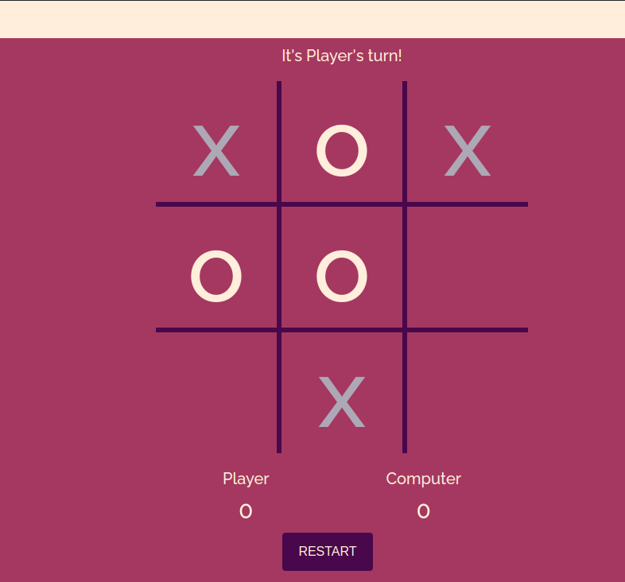
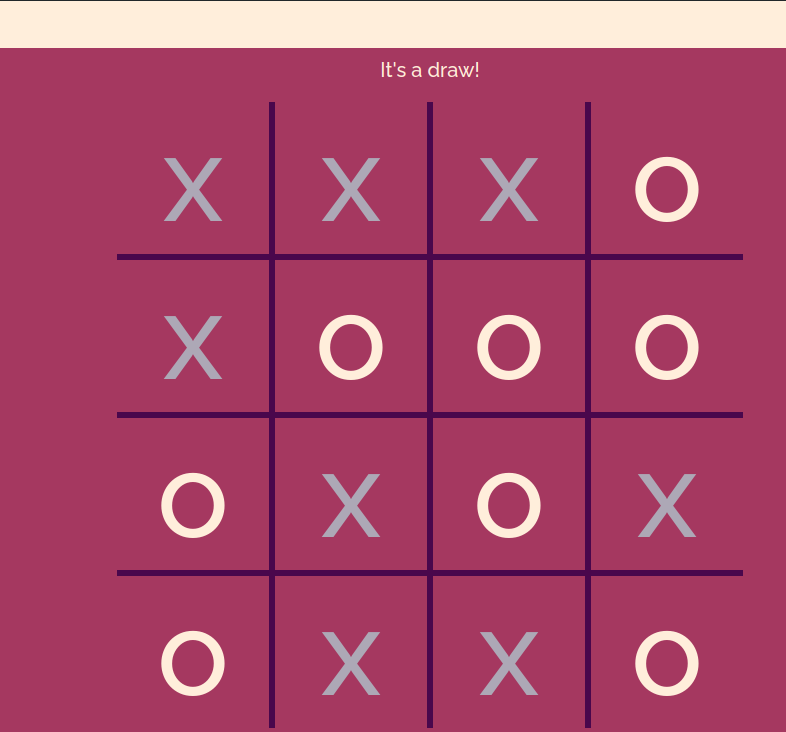
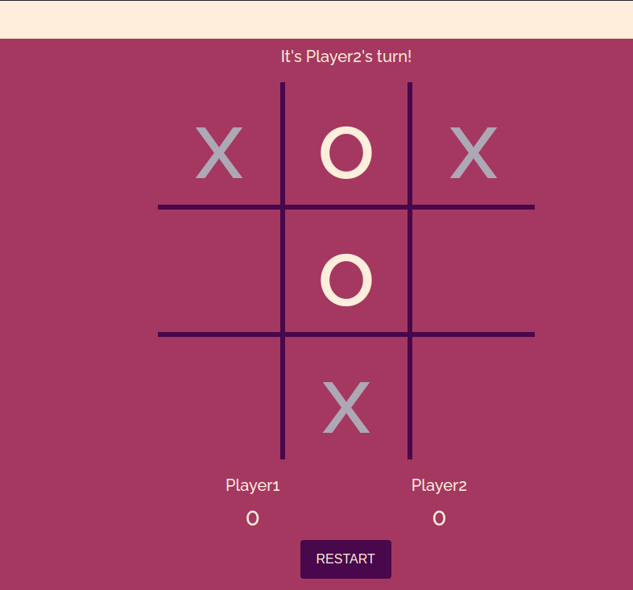

# Project#0 - Tic Tac Toe

You can play it in [here](https://unbeatable-tic-tac-toe-silk.vercel.app/), Give it a go!

All comments and suggestions are welcome!

# Player Vs AI screenshot :

# Player vs Player(4x4 grid) screenshot :

# Player vs Player (3x3 grid) screenshot :

## Overview

As required, I made this simple tic tac toe game as my individual project. It's built with html, css and javascript/**jQuery**.

## Features

- Players can toggle between **Versus Mode** and **VS Computer Mode** on 3x3 grid

- **Beat-me-if-you-can AI**

- **Players can toggle between 3x3 or 4x4 grid**

___

## Acknowledgments

- I used [animate.css](https://github.com/daneden/animate.css) library during the process, it's an easy-to-use library of CSS animations!

- I used [Font Awesome](http://fontawesome.io/) to search for icons.

- I found my color palette for this game on [Coolors](https://coolors.co/).

